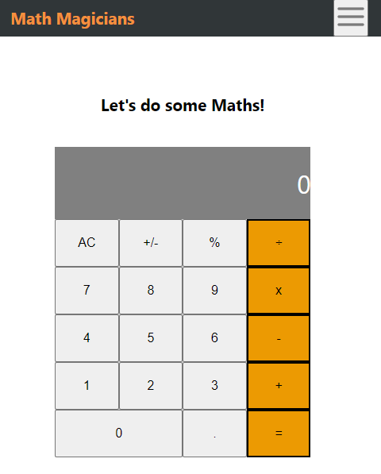

# Math-Magician

This is my Math-Magician project setup in the Microverse curriculum. "Math magicians" is a website for all fans of mathematics. It is a Single Page App (SPA) created using React and allows users to make simple calculation and read a random math-related quote.

## Built With

- HTML
- CSS
- React App
- GitHub

## Live Demo

[Live Demo Link](https://math-magician-calc-app.netlify.app/)

## Getting Started

To get a local copy up and running:

1. Clone this repository or download the Zip folder:

**``git clone https://aburayhaan.github.io/Math-Magicians/``**

1. Navigate to the location of the folder in your machine:

**``you@your-Pc-name:~$ cd <folder>``**

## Author

👤 **Hammed Adisa**

- Github: [@AbuRayhaan](https://github.com/AbuRayhaan)

- LinkedIn: [Adisa Hammed](https://www.linkedin.com/in/hammed-adisa-b4378372/)

## Contributing

Contributions, issues, and feature requests are welcome!

## Show your support

Give a ⭐ if you like this project and how we manage to build it!

## 📝 License

This project is [MIT](https://github.com/AbuRayhaan/Math-Magicians/blob/main/LICENSE)
